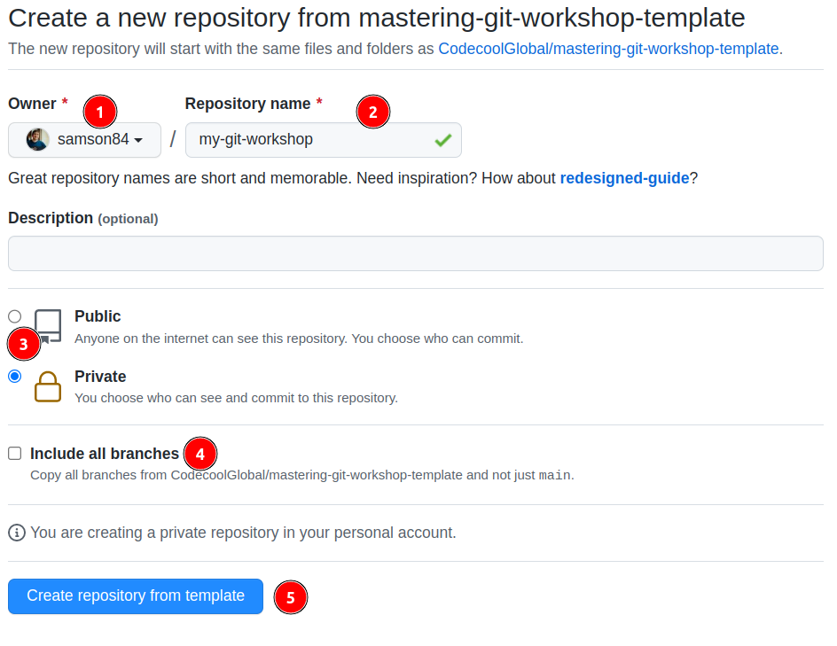

# Mastering GIT Workshop

In this workshop you will work in pairs and implement small features in the js files found in this repo and you will work in branches and use Pull Requests on Github to integrate these changes into the main branch. 

Do the following steps to prepare the working environment
for the workshop. You will be working in pairs, so one repo/
2 sudents are enough.

## Create a new repo from the template

1. Select **Use this template**.
2. Select **Create a new repository**.

1. Select your Github account for the Owner.
2. You can name the repository as you want, it will be created with this name in your account.
3. You can choose public or private repo. I would recommend private, because it is not a project just an exercise, maybe you don't want to everybody see it.
4. You can keep include all branches unchecked.
5. Click on the create repository

## Invite your peer to your new repo

Navigate to your newly created repo in your Github account.

1. Click to repo **Settings** tab.
2. Click to **Collaborators** on the sidebar.
3. Use the **Add people** button to add your peer as a collaborator to your repo.

## Clone the repository as usual

1. Clone you and your peer the repo as usual.

## Install the Git Graph VS Code extension

1. Click on the Extensions pane in VS Code
2. Search for "Git Graph" [VS Code Marketplace: Git Graph](https://marketplace.visualstudio.com/items?itemName=mhutchie.git-graph)
3. Install and Enable it.

## Tasks

The workshop consists of three sections (found in folders 0, 1, and 2). In each section, both people of the pair will implement a feature on a separate branch and use pull requests on github to integrate these changes into the main branch.

In the folders 0 and 1, the members will work in separate files, but in folder 2, both tasks are in one file.

The following steps should be followed when solving a section:
1. Create feature branch (and checkout that branch)
2. Implement the solution
3. Commit
4. Push
5. Make Pull Request on Github
6. Review, and if good, then merge the other person's Pull Request.
7. When your feature was merged on github, then checkout the main branch and pull

